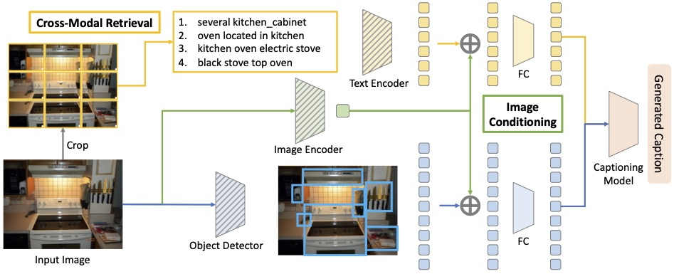

# Beyond a Pre-Trained Object Detector: Cross-Modal Textual and Visual Context for Image Captioning

This is the official PyTorch implementation of our CVPR 2022 paper:
__Beyond a Pre-Trained Object Detector: Cross-Modal Textual and Visual Context for Image Captioning__, [Chia-Wen Kuo](https://sites.google.com/view/chiawen-kuo/home) and [Zsolt Kira](https://faculty.cc.gatech.edu/~zk15/).  
[[arXiv](https://arxiv.org/abs/2205.04363)] [[Project](https://sites.google.com/view/xmodal-context/home)]

## Abstract

Significant progress has been made on visual captioning, largely relying on pre-trained features and later fixed object detectors that serve as rich inputs to auto-regressive models. A key limitation of such methods, however, is that the output of the model is conditioned only on the object detector's outputs. The assumption that such outputs can represent all necessary information is unrealistic, especially when the detector is transferred across datasets. In this work, we reason about the graphical model induced by this assumption, and propose to add an auxiliary input to represent missing information such as object relationships. We specifically propose to mine attributes and relationships from the Visual Genome dataset and condition the captioning model on them. Crucially, we propose (and show to be important) the use of a multi-modal pre-trained model (CLIP) to retrieve such contextual descriptions. Further, the object detector outputs are fixed due to a frozen model and hence do not have sufficient richness to allow the captioning model to properly ground them. As a result, we propose to condition both the detector and description outputs on the image, and show qualitatively that this can improve grounding. We validate our method on image captioning, perform thorough analyses of each component  and importance of the pre-trained multi-modal model, and demonstrate significant improvements over the current state of the art, specifically +7.5% in CIDEr and +1.3% in BLEU-4 metrics.



## Repo Structure

Please follow the instructions in [`ctx`](./ctx) to download/re-build the cross-modal visual and textual context first, and then move on to [`m2`](./m2) to train the image captioning model.

- The [`ctx` folder](./ctx) contains code for downloading or re-building the cross-modal visual and textual context.

- The [`m2` folder](./m2) contains code for incorporating our proposed method into the [M<sup>2</sup>](https://github.com/aimagelab/meshed-memory-transformer) image captioning model.

## Installation

This is project is developed and tested in `Python==3.8` and `PyTorch==1.10`.

```bash
# create a conda env
conda env create -f environment.yml
conda activate xmodal-ctx

# Download spacy English data
python -m spacy download en_core_web_sm
```

## Citation

```BibTeX
@inproceedings{kuo2022pretrained,
    title={Beyond a Pre-Trained Object Detector: Cross-Modal Textual and Visual Context for Image Captioning},
    author={Chia-Wen Kuo and Zsolt Kira},
    booktitle={Proceedings of the IEEE/CVF Conference on Computer Vision and Pattern Recognition},
    year={2022}
}
```
