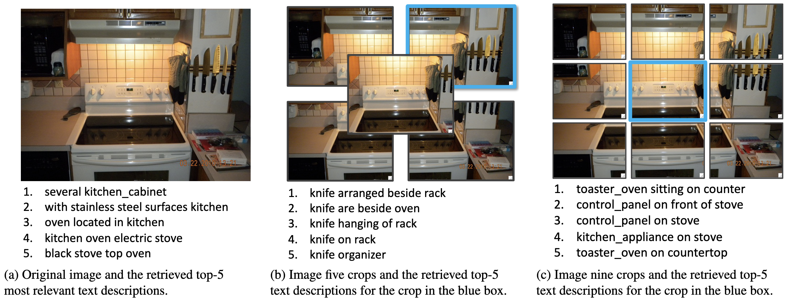

# Cross-modal context

## Download the pre-computed context (Recommend)

### Visual context

```bash
mkdir -p outputs && cd outputs

# Download visual context from:
# https://gtvault-my.sharepoint.com/:u:/g/personal/ckuo45_gatech_edu/EWzkWzQv-KhOtEl-OV6r8usBS2RFumoWa3OqVtcBPFyhlg?e=WcNqHA
unzip image_features.zip
rm image_features.zip
```

### Textual context

```bash
mkdir -p outputs && cd outputs

# Download textual context from:
# https://gtvault-my.sharepoint.com/:u:/g/personal/ckuo45_gatech_edu/ETs-XvhN3HlEpJV_yJnfHekBuAIRDTFJUsUFH_3CbtdPlw?e=aUYkMH
unzip retrieved_captions.zip
rm retrieved_captions.zip
```

## Re-build the context from scratch

:warning: It's totally safe to skip this step if you've already downloaded the pre-computed visual and textual context in the previous step.

### Download datasets

#### MS-COCO

```bash
mkdir -p datasets/coco_captions
cd datasets/coco_captions

# Download the training and validation images
wget http://images.cocodataset.org/zips/train2014.zip
wget http://images.cocodataset.org/zips/val2014.zip
unzip "*.zip"
rm *.zip

# Download the annotations
gdown --fuzzy https://drive.google.com/file/d/1i8mqKFKhqvBr8kEp3DbIh9-9UNAfKGmE/view?usp=sharing
unzip annotations.zip
rm annotations.zip
```

#### Visual Genome

```bash
mkdir -p datasets/visual_genome
cd datasets/visual_genome

# Download the images
wget https://cs.stanford.edu/people/rak248/VG_100K_2/images.zip
wget https://cs.stanford.edu/people/rak248/VG_100K_2/images2.zip
unzip "*.zip"
rm *.zip

# Download the annotations
wget https://visualgenome.org/static/data/dataset/attributes.json.zip
wget https://visualgenome.org/static/data/dataset/relationships.json.zip
unzip "*.zip"
rm *.zip
```

### Re-build the visual context

Re-build the visual context using GPU#0 (can be any GPU that is available on your machine).

```bash
python encode_images.py --device 0
```

### Re-build the textual context

Re-build the textual context using GPU#1 (can be any GPU that is available on your machine).

```bash
# First, encode the captions of the Visual Genome dataset
python encode_captions.py --device 1

# Then, perform cross-modal retrieval using CLIP
python retrieve_captions.py --device 1
```

## How to use the context?

We introduce the structure of the visual context `vis_ctx.hdf5` and textual context `txt_ctx.hdf5`, and provide code snippets for how to use them.

### Visal context

The visual context encodes all images in MSCOCO with a frozen pre-trained CLIP-I (visual branch of CLIP). The `vis_ctx.hdf5` file is structures as:

```Text
vis_ctx.hdf5
    |
    +-- img_id (str): encoded features (float numpy array of (768, ) shape)
    |
    ...

```

For example, the following code snippet allow us to get the features of image 531912:

```Python
import h5py

img_id = 531912
with h5py.File("vis_ctx.hdf5", "r") as f:
    feat_img = f[str(img_id)][:]

print(feat_img.shape)  # (768,)
print(type(feat_img))  # <class 'numpy.ndarray'>
print(feat_img.dtype)  # float32
```

### Textual context

The textual context contains the encoded text descriptions retrieved by using the query of the whole image, image five crops, or image nine crops illustrated in the figure below. The retrieved text descriptions are encoded by CLIP-T (textual branch of CLIP). Please see the paper for more details. In this project, we record the top-k (default k=16) results sorted by descending order, including the retrieved text descirptions, similarity scores, and encoded features. 

The `txt_ctx.hdf5` file is structured as:

```Text
txt_ctx.hdf5
    |
    +-- img_id (str)
    |       |
    |       +-- "whole"
    |       |       |
    |       |       +-- "features": encoded top-k texts (float numpy array of (k, d) shape)
    |       |       |
    |       |       +-- "scores": similarity scores (float numpy array of (k, ) shape)
    |       |       |
    |       |       +-- "texts": top-k retrieved texts (list of string of (k, ) shape)
    |       |
    |       +-- "five"
    |       |       |
    |       |       +-- "features": encoded top-k retrieved texts of each crop  (float numpy array of (5, k, d) shape)
    |       |       |
    |       |       +-- "scores": similarity scores of each crop (float numpy array of (5, k) shape)
    |       |       |
    |       |       +-- "texts": top-k retrieved texts of each crop (list of list of string of (5, k) shape)
    |       |
    |       +-- "nine"
    |               |
    |               +-- "features": encoded top-k retrieved texts of each crop  (float numpy array of (9, k, d) shape)
    |               |
    |               +-- "scores": similarity scores of each crop (float numpy array of (9, k) shape)
    |               |
    |               +-- "texts": top-k retrieved texts of each crop (list of list of string of (9, k) shape)
    |
    ...

```

For example, for image 531912, the following code snippet allow us to access its top-4 retrieval results using the 2<sup>_nd_</sup> crop of five crops as the query:

```Python
import h5py

img_id = 531912
top_k = 4
crop_n = 2
with h5py.File("txt_ctx.hdf5", "r") as f:
    features = f[f"{img_id}/five/features"][crop_n, :top_k]
    scores = f[f"{img_id}/five/scores"][crop_n, :top_k]
    texts = f[f"{img_id}/five/texts"][crop_n, :top_k]

print(features.shape)  # (4, 512)
print(scores.shape)  # (4,)
print(len(texts))  # 4
```

## Next Step

Once the visual and textual context are downloaded/re-built, it's time to train the model! Check out the [`m2` folder](../m2) for how to incorporate the visual and textual context.
